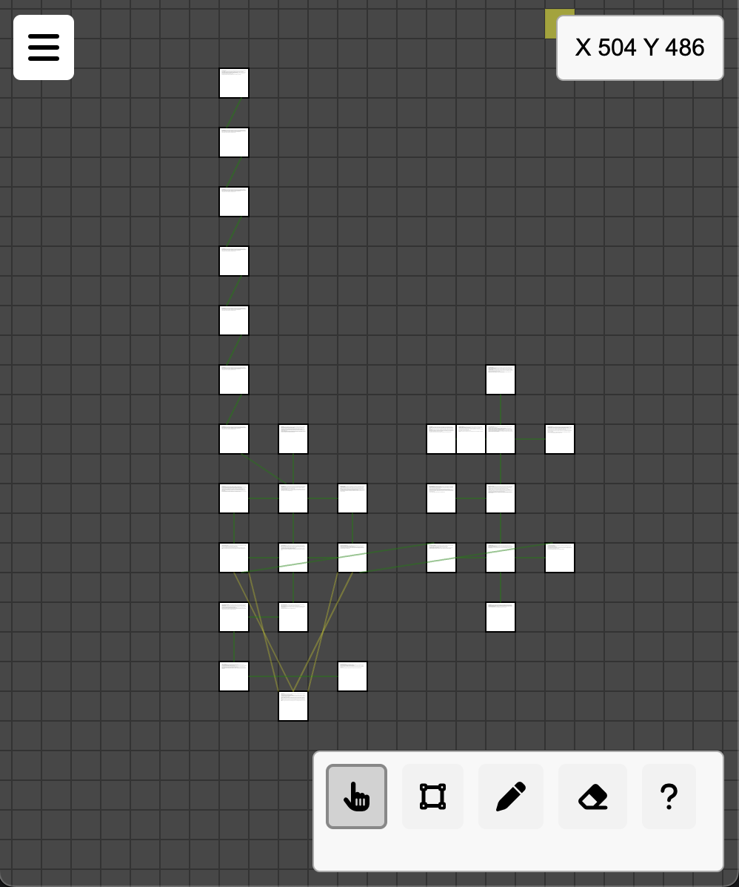

# Node Talker Web Builder Tool

Node Talker Web Builder Tool is a web-based interface designed for creating and managing zones for the [Node Talker](https://github.com/tvalladon/node-talker) telnet social role-playing server system. This tool provides an intuitive way to design zones, save and share them, and generate files ready for server deployment.

## Demo
Try the fully functional demo at [Node Talker Web Builder](https://tvalladon.github.io/node-talker-web-builder/).

## Features
- **Create and Manage Rooms:** Easily create, edit, and delete rooms on a grid-based interface.
- **Room Properties:** Define room properties such as name, description, lockable, locked, temporary, solo, creator, owner, and exits.
- **Pan and Zoom:** Navigate the grid with seamless pan and zoom functionalities.
- **Detailed Room View:** Zooming in on a room reveals detailed information including the room name, zone ID, room ID, and description, elegantly displayed within the room square.
- **Tool Pallet:** Use different tools for creating, editing, erasing rooms, and navigating the grid.
- **Save and Load Zones:** Save your zones to a file and load them later to continue editing.
- **Export to Zip:** Generate a zip file containing JSON files for each room, ready for server deployment.
- **Real-time Preview:** See a real-time preview of your zones as you create and edit them.

## Persistent Data Storage

Node Talker Web Builder Tool leverages your browser's local storage to save your work between sessions. This means you can close the browser or navigate away from the page, and your current zone layout will be preserved and automatically reloaded the next time you open the tool. This ensures that you won't lose your progress and can continue building from where you left off.

However, we strongly encourage you to regularly use the "Save Map" and "Load Map" functionalities to manually back up and restore your work. This provides an additional layer of security for your data in case something goes wrong with the local storage.

## Libraries and Dependencies
The project uses the following libraries, which are included via CDN in the HTML file:
- [Konva](https://cdnjs.cloudflare.com/ajax/libs/konva/9.0.0/konva.min.js) for canvas rendering.
- [JSZip](https://cdnjs.cloudflare.com/ajax/libs/jszip/3.10.1/jszip.min.js) for creating zip files.
- [Font Awesome](https://cdnjs.cloudflare.com/ajax/libs/font-awesome/6.5.2/css/all.min.css) for icons.

## Getting Started

### Running Locally
1. Clone the repository:
   ```bash
   git clone https://github.com/yourusername/node-talker-web-builder.git
   ```
2. Open the `index.html` file in your web browser.

### Hosting on Your Own Server
1. Clone the repository:
   ```bash
   git clone https://github.com/yourusername/node-talker-web-builder.git
   ```
2. Serve the files using any web server. For example, using Python's built-in HTTP server:
   ```bash
   cd node-talker-web-builder
   python3 -m http.server
   ```
3. Open your browser and navigate to `http://localhost:8000`.

## Usage

### Interface Overview
- **Konva Container:** The main canvas area where rooms are displayed and managed.
- **Hamburger Menu:** Toggle the expanded menu for additional options like saving and loading maps.
- **Tool Pallet:** Contains tools for panning, creating rooms, editing rooms, erasing rooms, and navigating the grid.
- **Coordinates Display:** Shows the current grid coordinates of the mouse pointer.
- **Slide-Out Form:** A dynamic form for editing room properties.

### Tools
- **Pan/Zoom Tool:** Navigate the grid by panning and zooming.
- **Create Rooms Tool:** Create new rooms on the grid.
- **Edit Rooms Tool:** Edit existing room properties.
- **Erase Rooms Tool:** Remove rooms from the grid.
- **Help Tool:** Display help information.

### Menu Options
- **Zone ID and Starting Room ID:** Input fields to set the zone ID and starting room ID.
- **New Map:** Clear the current map and start a new one.
- **Save Map:** Save the current map to a file.
- **Load Map:** Load a map from a file.
- **Process Map:** Generate a zip file containing JSON files for each room, ready for server deployment.

## Exporting and Importing Zones
- **Saving a Map:** Click on the "SAVE MAP" menu item to download the current zone as a `.map` file.
- **Loading a Map:** Click on the "LOAD MAP" menu item and select a `.map` file to continue editing.
- **Processing a Map:** Click on the "PROCESS MAP" menu item to generate a zip file containing JSON files for each room, which can be extracted to the server's `db/rooms` directory.

## Example Map

Here is an example map:



## Contributing

We welcome contributions from the community to enhance the Node Talker Web Builder Tool! If you're interested in helping with development, please feel free to fork the repository, make your changes, and submit a pull request. Whether you're fixing bugs, adding new features, or improving documentation, your contributions are greatly appreciated.

Please note that this tool is a lower priority for me as most of my time will be spent on developing [Node Talker](https://github.com/tvalladon/node-talker) itself. Therefore, community contributions are crucial for the continued improvement and maintenance of this tool.

If you have any questions or need guidance, don't hesitate to open an issue or reach out. Let's collaborate to make this tool even better!

### Feature Hitlist

Here are some features we would love to see added:

- Functionality to copy and paste rooms.
- Improved UI/UX for the room editing form.
- Bulk editing of room properties.
- Undo/redo functionality.
- Performance optimizations for larger maps.
- Tutorial and user guide.
- Load images to replace background...

Feel free to pick any of these or suggest your own improvements!

## TODO

- [x] Figure out how to handle up/down exits.
- [x] Add room props.
- [ ] Add form for editing zone values and settings.
- [ ] Improve the UI/UX for the room editing form.
- [ ] Create sample maps.
- [ ] Optimize performance for larger maps.
- [x] Add ability to move rooms while keeping connections intact.
- [ ] Implement undo/redo functionality.
- [ ] Load images to replace background.

## License
This project is licensed under the MIT License.

---

This tool was built to simplify the creation and management of zones for [Node Talker](https://github.com/tvalladon/node-talker). We hope it enhances your role-playing experience!